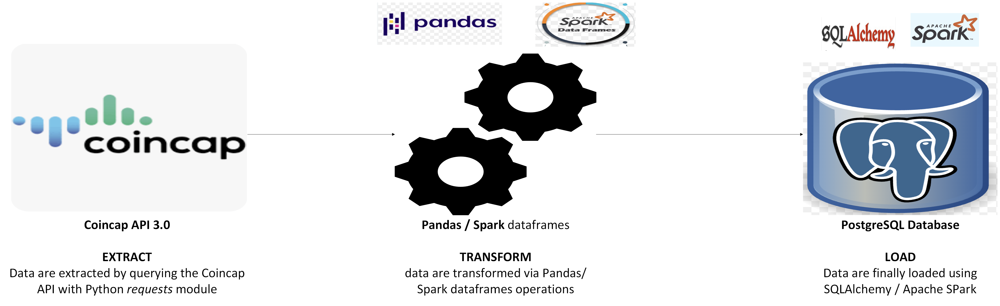

# Crypto Timeseries
This repository contains a simple **ETL pipeline** that extracts cryptocurrency market data from the [CoinCap API 3.0](https://docs.coincap.io/) and loads it into a PostgreSQL database.

The *ETL workflow* has been implemented with different engines and workflow orchestrator:

- [main_etl_sqlalchemy.ipynb](link) -> database engine: [SQLAlchemy](https://www.sqlalchemy.org/)
- [main_etl_pyspark.ipynb](link) -> database engine: [Apache Spark](https://spark.apache.org/)
- [api_etl_database_dag.py](link) -> database engine: [Apache Spark](https://spark.apache.org/), workflow orchestrator: [Apache Airflow](https://airflow.apache.org/)

## Data
Data extracted and loaded into the database contain the following fields:

- timestamp:            timestamp
- id:                   string
- rank:                 int
- symbol:               string
- name:                 string
- supply:               double
- maxsupply:            double
- marketcapusd:         double
- volumeusd24hr:        double
- priceusd:             double
- changepercent24hr:    double
- vwap24hr:             double
- explorer:             string

## Data Pipeline

## Setup
